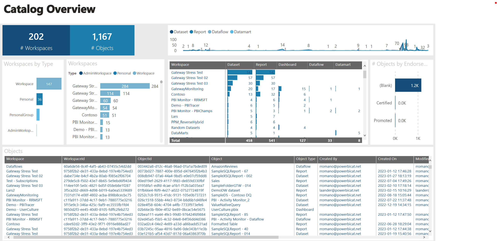
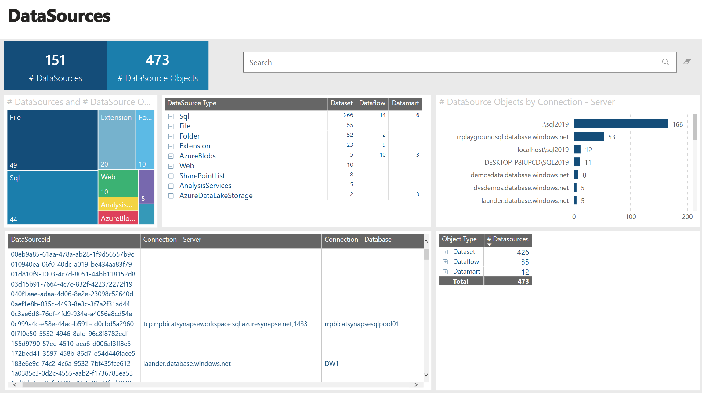
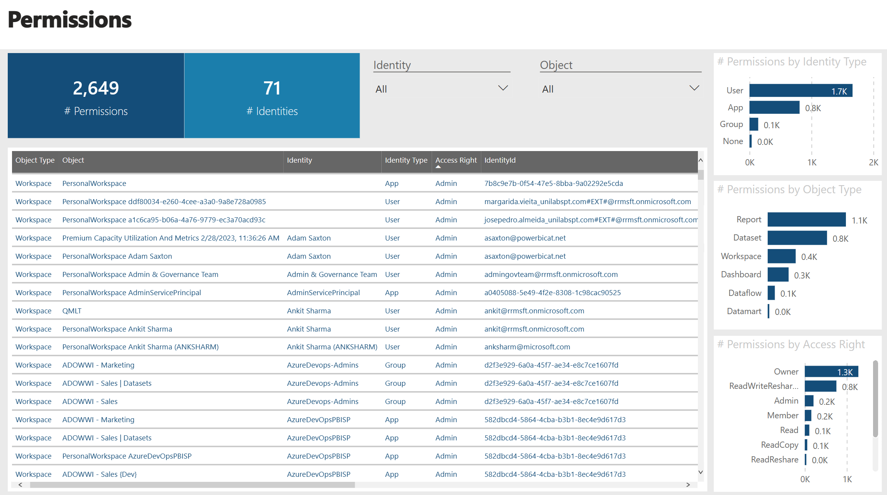
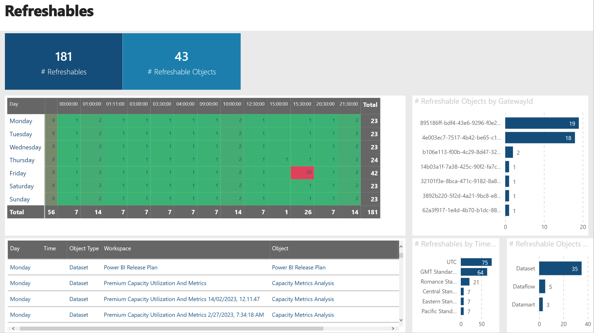
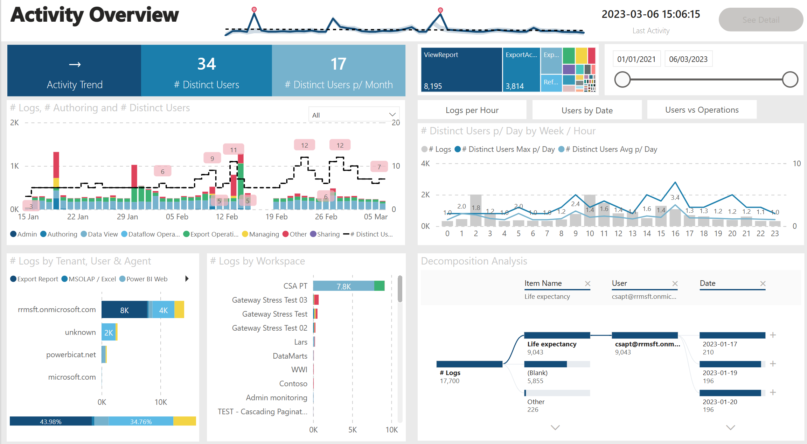
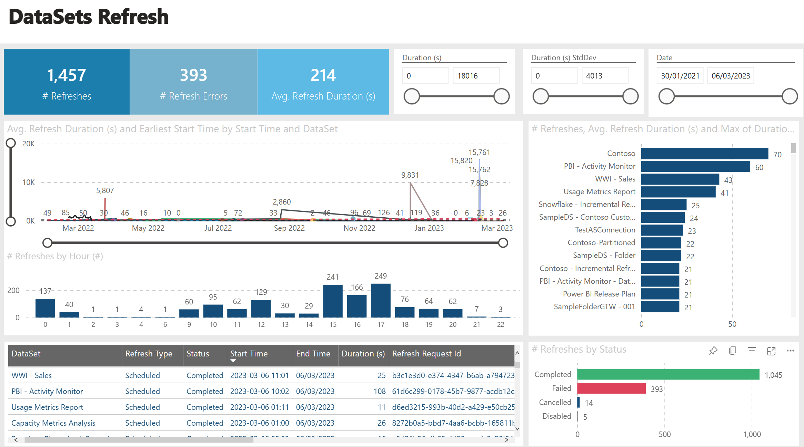

# Overview

Collection of simple scripts and Power BI templates that scan the Power BI tenant.

No need for any deployment, just:

- Run the script
- Open the PBIT and target the output folder

# Inventory Report

# Activity Report

# Refresh History Report

